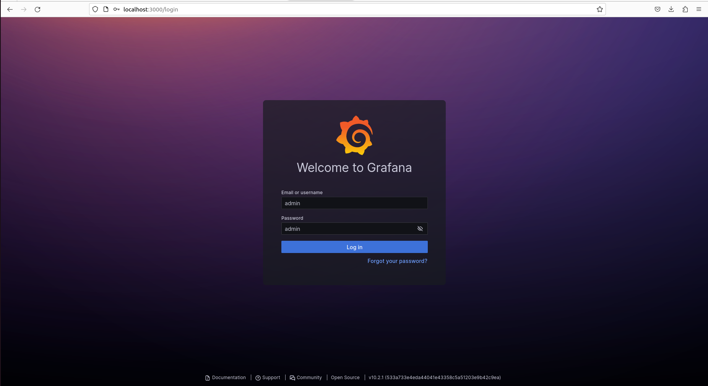
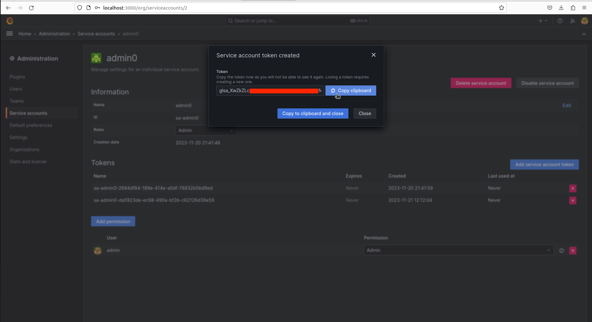

Usage
=====

.. _installation:

Installation
------------

You can find the necessary technologies, packages, libraries and how to install them based on your operating system below:

On local host

You need

- MongoDB
- InfluxDB 1.8
- Grafana 9+ (OSS)
- Additional additional requierements
- Run the server

.. warning::

   It is important that you install the correct versions.

.. note::

   In the SuperTwin repository, you can find a directory called setup which automizes the setup process by detecting your operating system. 
   You can run it to install required dependencies and libraries all at once.
   

1) Ubuntu 20.04
+++++++++++++++

1.1) MongoDB Installation
^^^^^^^^^^^^^^^^^^^^^^^^^

First step is to install the GPT key.

.. code-block:: console

   sudo apt-get install gnupg curl

Next import the MongoDB public GPG key.

.. code-block:: console

   curl -fsSL https://pgp.mongodb.com/server-7.0.asc | \sudo gpg -o /usr/share/keyrings/mongodb-server-7.0.gpg \--dearmor

Create repository for MongoDB

.. code-block:: console

   echo "deb [ arch=amd64,arm64 signed-by=/usr/share/keyrings/mongodb-server-7.0.gpg ] https://repo.mongodb.org/apt/ubuntu jammy/mongodb-org/7.0 multiverse" | sudo tee /etc/apt/sources.list.d/mongodb-org-7.0.list

Update local package index.

.. code-block:: console

   sudo apt-get update

Finally to install mongoDB.

.. code-block:: console

   sudo apt-get install -y mongodb-org

You may check if the installation was successful by running this command.

.. code-block:: console

   mongod --version
   
1.2) MongoDB Compass Installation
^^^^^^^^^^^^^^^^^^^^^^^^^^^^^^^^^

Download the MongoDB Compass

After the installation, start the service

.. code-block:: console

   sudo systemctl start mongod.service
   
You may check if the system is active

.. code-block:: console

   sudo systemctl status mongod.service
   
..Open the application and click on the connect button.

1.3) InfluxDB Installation
^^^^^^^^^^^^^^^^^^^^^^^^^^

Install InfluxDB

.. code-block:: console

   wget https://dl.influxdata.com/influxdb/releases/influxdb_1.8.10_amd64.deb
   sudo dpkg -i influxdb_1.8.10_amd64.deb

You may check if the installation was successful by running this command.

.. code-block:: console

   sudo influxd

1.4) Grafana 10.2.1 (OSS) Installation
^^^^^^^^^^^^^^^^^^^^^^^^^

Install the Grafana

.. code-block:: console

   sudo apt-get install -y adduser libfontconfig1 musl
   wget https://dl.grafana.com/oss/release/grafana_10.2.1_amd64.deb
   sudo dpkg -i grafana_10.2.1_amd64.deb

Start Grafana service

.. code-block:: console

   sudo systemctl start grafana-server.service

You may check if the system is active

.. code-block:: console
   
   sudo systemctl status grafana-server.service

Connect to `localhost:3000 <http://localhost:3000>`_ and the Grafana login page will show up. If you are logging in for the first time, your default username and password is **admin**. 

You need to click **Toggle menu** from the left top and go to the **Administrations -> Service accounts**. Click **Add service acount** from the right top.

Choose a display name and change the role to the **Admin** and create account.

Click on the user that you created and click **Add service account token** and than click generate token.

Copy the code to the clipboard.

Open your terminal and open your **env.txt** file.

.. code-block:: console
   
   code env.txt

Replace the **GRAFANA_TOKEN** code with the code that you copied to your clipboard.

1.5) Install additional requirements
^^^^^^^^^^^^^^^^^^^^^^^^^^^^^^^^^^^^

.. code-block:: console

   sudo apt install python3-pip
   sudo pip3 install influxdb
   sudo pip3 install pymongo
   sudo pip3 install grafanalib
   sudo pip3 install pandas
   sudo pip3 install plotly
   sudo pip3 install scp
   sudo pip3 install matplotlib

Install these requierements to the remote

.. code-block:: console

   sudo apt install cpuid
   sudo apt-get install likwid
   sudo apt-get install pcp
   /var/lib/pcp/pmdas/lmsensors$ sudo ./Install
   sudo apt-get install lm-sensors
   /var/lib/pcp/pmdas/perfevent$ sudo ./Install

1.7) Run the server
^^^^^^^^^^^^^^^^^^^

Clone the repository

.. code-block:: console

   git clone https://github.com/sparcityeu/Digital-SuperTwin.git

Inside of the SuperTwin directory

.. code-block:: console

   sudo python3 supertwin.py

2) Manjaro
++++++++++

3) Mac
++++++
3.1) XCode Developer Tools

Install XCode developer tools using the command below

.. code-block:: console

   xcode-select --install

3.2) Homebrew

Install homebrew by using the following command

.. code-block:: console

   /bin/bash -c "$(curl -fsSL https://raw.githubusercontent.com/Homebrew/install/HEAD/install.sh)"

3.3) MongoDB

tap mongodb homebrew tap

.. code-block:: console

   brew tap mongodb/brew

updating homebrew

.. code-block:: console
   
   brew update

installing mongodb

.. code-block:: console
   
   brew install mongodb-community@6.0

3.4) InfluxDB

Install influxdb using homebrew

.. code-block:: console

   brew install influxdb

3.5) Grafana

Install Grafana using homebrew

.. code-block:: console

   brew install grafana

3.6) MongoDB Compass 

Install MongoDB Compass using the link: https://www.mongodb.com/docs/compass/current/install/

   